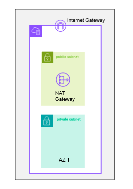
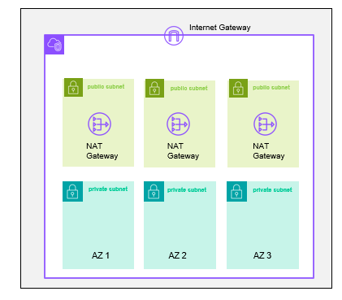
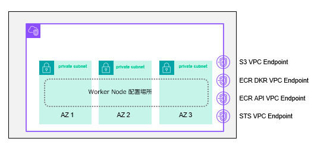

## 1. Terraform を使用した ROSA を install する AWS Network の作成

HCP ROSA は、ユーザーが既にもっているネットワークにデプロイする事が前提になります。
ここでは Terraform を使用して AWS　上に Network を作成します。

この手順は、公式ドキュメントの[「2.3.1.2. Creating a Virtual Private Cloud using Terraform」](https://docs.redhat.com/en/documentation/red_hat_openshift_service_on_aws/4/html/install_clusters/rosa-hcp-sts-creating-a-cluster-quickly#rosa-hcp-vpc-terraform_rosa-hcp-sts-creating-a-cluster-quickly) をベースにしています。



ROSA をインストールする Subnet はどんな方法で作成しても良いですが、指定された`Tag`を付ける要件があります[[参考:2.3.3.1. Tagging your subnets]](https://docs.redhat.com/en/documentation/red_hat_openshift_service_on_aws/4/html/install_clusters/rosa-hcp-sts-creating-a-cluster-quickly#rosa-hcp-vpc-subnet-tagging_rosa-hcp-sts-creating-a-cluster-quickly) 。この手順で提供されている terraform のスクリプトは必要な `Tag`も全て付けてくれます。



### 1.1. Terraform を使用した AWS Network リソースの作成

サンプルで提供されている terraform のテンプレートを使って、AWS の VPC、Subnet、NAT Gateway 等の必要なリソースを作成します。

1. Repository からサンプルの terraform をダウンロードし初期化します。

```tpl
git clone https://github.com/openshift-cs/terraform-vpc-example
```


ダウンロードしたディレクトリに移動します。

```tpl
cd terraform-vpc-example
```

2. 変数を準備しておきます。

`CLUSTER_NAME` は自分の好きなクラスター名で大丈夫です。この名前は Subnet のタグ名で使われます。この変数は、後で ROSA Cluster を作成する時にも使われます。

```tpl
export CLUSTER_NAME=myhcpcluster
```

`REGION` には、`ap-northeast-1` にクラスターを指定します。もちろん他のリージョンを指定しても大丈夫です。この変数は後で、ROSA Cluster の作成先を指定する時にも使われます。

```tpl
export REGION=ap-northeast-1
```

3. Terraform の plan を作成します。


Single AZ の Network 構成をデプロイするか、Multi AZ の Network を作成するか、どちらかを選びます。




# Single AZ Network


初期化します。

```tpl
terraform init
```

プランを出力します。

```tpl
terraform plan -out rosa.tfplan -var region=$REGION -var cluster_name=$CLUSTER_NAME 
```




4. Plan を apply して Network を作成します。

```tpl
terraform apply rosa.tfplan
```

実際に VPC や Subnet、NAT Gateway 等が作成されるので数分、時間がかかります。

5. 作成された AWS のサブネットIDを変数にセットしておきます。カンマ区切りで2つ(Single AZ) もしくは6つ(Multi AZ) のサブネットIDが変数にセットされます。

```tpl
export SUBNET_IDS=$(terraform output -raw cluster-subnets-string)
```



# Multi AZ Network


初期化します。

```tpl
terraform init
```

プランを出力します。

```tpl
terraform plan -out rosa.tfplan -var region=$REGION -var cluster_name=$CLUSTER_NAME -var single_az_only=false
```


4. Plan を apply して Network を作成します。

```tpl
terraform apply rosa.tfplan
```

実際に VPC や Subnet、NAT Gateway 等が作成されるので数分、時間がかかります。

5. 作成された AWS のサブネットIDを変数にセットしておきます。カンマ区切りで2つ(Single AZ) もしくは6つ(Multi AZ) のサブネットIDが変数にセットされます。

```tpl
export SUBNET_IDS=$(terraform output -raw cluster-subnets-string)
```


# Multi AZ Network (Egress Lockdown)



`Egress Lockdown` 環境は、ネットワークの要件が少し違うので、terraform のサンプルも別になっています。 `zero-egress` ディレクトリに移動します。

```tpl
cd zero-egress
```

初期化します。
```tpl
terraform init
```

プランを出力します。この Terraform は手動で AZ を指定してあげる必要があります。ここでは ap-northeast-1 (Tokyo) の AZ 名を渡しています。

```tpl
terraform plan -out rosa.tfplan -var region=$REGION -var cluster_name=$CLUSTER_NAME -var 'availability_zones=["ap-northeast-1a","a
p-northeast-1c", "ap-northeast-1d"]'```
```
以下のようなネットワークが作成されます。



このネットワークを作成した場合は、必ず`Private Cluster`を作成する事になります。
Red Hat 製のコンポーネントは、AWS閉域網内の Red Hat が提供する ECR からコンポーネントが提供されます。
Red Hat 製以外の 3rd Party コンポーネント (IBM製品含む) を、クラスター作製後にインストールしたい場合は、ユーザーが何らかの方法で環境内にコピーする運用が必要になります。


4. Plan を apply して Network を作成します。

```tpl
terraform apply rosa.tfplan
```

実際に VPC や Subnet、NAT Gateway 等が作成されるので数分、時間がかかります。

5. 作成された AWS のサブネットIDを変数にセットしておきます。カンマ区切りで2つ(Single AZ) もしくは6つ(Multi AZ) のサブネットIDが変数にセットされます。

```tpl
export SUBNET_IDS=$(terraform output -json private_subnet_ids | sed 's/^\[//;s/\]$//')
```






この手順では、ハンズオン用に幾つかのネットワーク設計パターンを提示していますが、ここで作成している以外のネットワーク構成も可能です。
例えば、2AZ 構成の `ROSA Cluster` も作成可能ですし、インターネット公開を目的としない `Private Cluster` の作成を目的としている場合は、`Public Subnet` が `Worker Node` が設置される VPC 内に必ずしも存在している必要はありません。




以上で Network の準備は完了です。

### 1.2. 作成された Subnet と NAT Gateway の確認 (オプショナル)


ROSA の構築で一番のはまりポイントは、AWS Network の構成です。この手順では terraform で Network を構成するので、嵌まる事はまずありませんが、手動で AWS GUI から作成した場合などはきちんと構成できてない事がありデバッグ用に CLI を覚えて置くと便利です。

ここでは CLI を使って作成した Network の情報を確認する方法をご紹介します。



terraform で apply した時のログにも出ていますが、ここでは AWS CLI の練習も兼ねて、AWS CLI を使用して作成された VPC と Subnet 等を確認します。

VPC をリストします。
```tpl
aws ec2 describe-vpcs | jq -r '.Vpcs[] | [.CidrBlock, .VpcId, .State] | @csv'
```

Subnet をリストします。
```tpl
aws ec2 describe-subnets | jq -r '.Subnets[] | [ .CidrBlock, .SubnetId, .AvailabilityZone, .Tags[].Value ] | @csv'
```

NAT Gateway をリストします。
```tpl
aws ec2 describe-nat-gateways | jq -r '.NatGateways[] | [.NatGatewayId, .State] | @csv'
```



