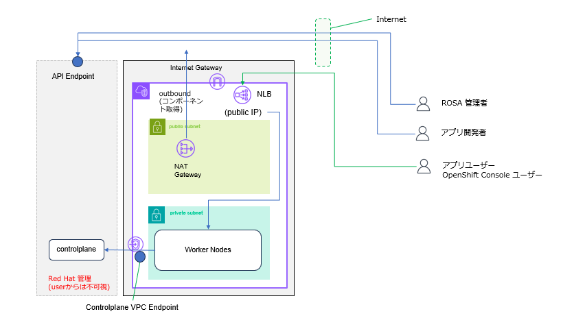
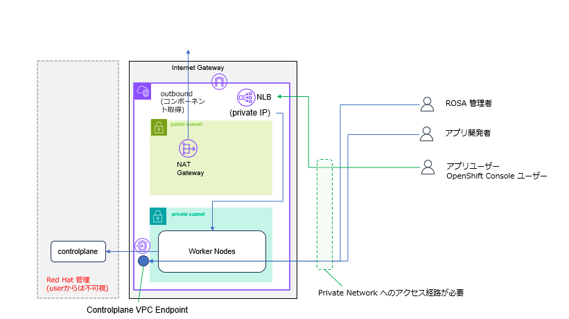
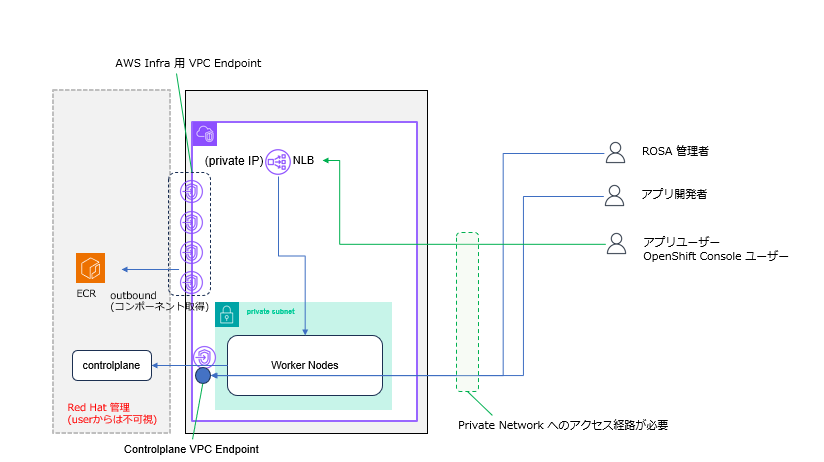

## 1.ROSA HCP Cluster 作成 のための事前準備

必要な変数が全てセットされているか再確認します。もしセットされてない場合は、以前の手順に戻ってセットして下さい。

```tpl
echo $CLUSTER_NAME
```
```tpl
echo $REGION
```
```tpl
echo $SUBNET_IDS
```

AWS の Account ID を変数にセットします。

```tpl
AWS_ACCOUNT_ID=$(aws sts get-caller-identity --query Account --output text)
```

内容を確認します。

```tpl
echo $AWS_ACCOUNT_ID
```


OIDC Config を作成し、作成された OIDC の ID を環境変数にセットします。(インタラクティブに構成したい場合は `-y -m auto` を外します)

```tpl
export OIDC_ID=`rosa create oidc-config --mode=auto --yes | grep -oP "(?<=openshiftapps\.com/)[^']+"`
```

作成された OIDC Config の ID が変数にセットされているか確認します。
```tpl
echo $OIDC_ID
```

必要な IAM Role (Account Role) を作成します。後で判別しやすいように、$CLUSTER_NAME のプリフィックスを使います。

```tpl
rosa create account-roles --hosted-cp --prefix -$CLUSTER_NAME -m auto -y
```

必要な IAM Role (Operator Role) を作成します。後で判別しやすいように、$CLUSTER_NAME のプリフィックスを使います。

```tpl
rosa create operator-roles --hosted-cp --prefix=$CLUSTER_NAME --oidc-config-id=$OIDC_ID --installer-role-arn arn:aws:iam::$AWS_ACCOUNT_ID:role/ManagedOpenShift-HCP-ROSA-Installer-Role -y -m auto
```


ここで `rosa` コマンドで必要な IAM Role を作成していますが、これは本来 `aws` CLI で行う作業を `rosa` コマンドでラップしているだけで、実際の作業は `aws` コマンドが行っています。
IAM Role の作成は、ROSA クラスターを作成するための準備作業として必要です。ROSA として、IAM Role を作成する権限は持っていません。 



## 2.ROSA HCP Cluster の 作成
Cluster の作成を開始します。いろいろ聞かれますが、全てデフォルトでエンターを叩いて大丈夫です。



# Public Cluster

```tpl
rosa create cluster --oidc-config-id $OIDC_ID --operator-roles-prefix $CLUSTER_NAME -c $CLUSTER_NAME  --hosted-cp 
```

途中で Subent を選択する画面がでてきますが、Public Cluster の場合は、1AZ につき Private Subnet と Publis Subnet をそれぞれ選択する必要があります。

3AZ 構成の場合は、合計で 6つの subnet (Private x 3 + Public x 3) の選択が必要です。
```tpl
...
? Subnet IDs:  [Use arrows to move, space to select, <right> to all, <left> to none, type to filter, ? for more help]
> [x]  subnet-084a4afc8e965123e ('myhcpcluster-vpc-public-apne1-az1','vpc-02def9c12b89e7123','ap-northeast-1c', Owner ID: '069425419555')
  [x]  subnet-05fdf3d935e7f4560 ('myhcpcluster-vpc-private-apne1-az1','vpc-02def9c12b89e7123','ap-northeast-1c', Owner ID: '069425419555')
...
```





# Private Cluster 

```tpl
rosa create cluster --oidc-config-id $OIDC_ID --operator-roles-prefix $CLUSTER_NAME -c $CLUSTER_NAME  --hosted-cp --private --default-ingress-private
```
途中で Subent を選択する画面がでてきますが、Private Cluster の場合は、1AZ につき Private Subnet を1つ選択する必要があります。

```tpl
...
? Subnet IDs:  [Use arrows to move, space to select, <right> to all, <left> to none, type to filter, ? for more help]
> [x]  subnet-05fdf3d935e7f4560 ('myhcpcluster-vpc-private-apne1-az1','vpc-02def9c12b89e7123','ap-northeast-1c', Owner ID: '069425419555')
...
```


**注意**: Private Cluster を作成した場合は、インターネットからアクセスできなくなるため、作成した Cluster が存在する AWS 上の Private Network に別途アクセスできる方法が必要になります。

Controlplane 機能を提供する VPC Endpoint の **Security Group 設定を変更して oc コマンドを実行する Network からのアクセスを、明示的に許可する必要があります**。デフォルトでは Worker Node のある
 VPC からしか Controplane の VPC Endpoint (Kubnernetes API の End Point) へのアクセスを許可していません。Security Group の設定変更については、[こちら](https://docs.redhat.com/ja/documentation/red_hat_openshift_service_on_aws/4/html/install_clusters/rosa-hcp-aws-private-security-groups_rosa-hcp-aws-private-creating-cluster) を参照下さい。




# Private Cluster (Egress Lockdown)


`Egress Lockdown`(インターネットにアクセスしない Install) のインストールコマンドは、基本的に `Private Cluster` と同じですが、`--properties zero_egress:true` のオプションを付けます。

```tpl
rosa create cluster --oidc-config-id $OIDC_ID --operator-roles-prefix $CLUSTER_NAME -c $CLUSTER_NAME  --hosted-cp --private --default-ingress-private --properties zero_egress:true
```
途中で Subent を選択する画面がでてきますが、Private Cluster の場合は、1AZ につき Private Subnet を1つ選択する必要があります。

```tpl
...
? Subnet IDs:  [Use arrows to move, space to select, <right> to all, <left> to none, type to filter, ? for more help]
  [x]  subnet-089858a83110c214c ('myhcpcluster-vpc-private-ap-northeast-1d','vpc-05dc0573b7a096e9d','ap-northeast-1d', Owner ID: '069425419456')
  [x]  subnet-05d358dce6ebebbb8 ('myhcpcluster-vpc-private-ap-northeast-1a','vpc-05dc0573b7a096e9d','ap-northeast-1a', Owner ID: '069425419456')
> [x]  subnet-0124a9f0c4934eb39 ('myhcpcluster-vpc-private-ap-northeast-1c','vpc-05dc0573b7a096e9d','ap-northeast-1c', Owner ID: '069425419456')
...
```


**注意**: Private Cluster を作成した場合は、インターネットからアクセスできなくなるため、作成した Cluster が存在する AWS 上の Private Network に別途アクセスできる方法が必要になります。

Controlplane 機能を提供する VPC Endpoint の **Security Group 設定を変更して oc コマンドを実行する Network からのアクセスを、明示的に許可する必要があります**。デフォルトでは Worker Node のある
 VPC からしか Controplane の VPC Endpoint (Kubnernetes API の End Point) へのアクセスを許可していません。Security Group の設定変更については、[こちら](https://docs.redhat.com/ja/documentation/red_hat_openshift_service_on_aws/4/html/install_clusters/rosa-hcp-aws-private-security-groups_rosa-hcp-aws-private-creating-cluster) を参照下さい。








```tpl
$ rosa create cluster --oidc-config-id $OIDC_ID --operator-roles-prefix $CLUSTER_NAME -c $CLUSTER_NAME  --hosted-cp 
I: Using '069425419456' as billing account
I: To use a different billing account, add --billing-account xxxxxxxxxx to previous command
W: Account roles not created by ROSA CLI cannot be listed, updated, or upgraded.
I: Using arn:aws:iam::069425419456:role/ManagedOpenShift-HCP-ROSA-Installer-Role for the Installer role
I: Using arn:aws:iam::069425419456:role/ManagedOpenShift-HCP-ROSA-Worker-Role for the Worker role
I: Using arn:aws:iam::069425419456:role/ManagedOpenShift-HCP-ROSA-Support-Role for the Support role
I: Reusable OIDC Configuration detected. Validating trusted relationships to operator roles: 
I: Using 'arn:aws:iam::069425419456:role/myhcpcluster-openshift-image-registry-installer-cloud-credential'
I: Using 'arn:aws:iam::069425419456:role/myhcpcluster-kube-system-capa-controller-manager'
I: Using 'arn:aws:iam::069425419456:role/myhcpcluster-kube-system-control-plane-operator'
I: Using 'arn:aws:iam::069425419456:role/myhcpcluster-kube-system-kms-provider'
I: Using 'arn:aws:iam::069425419456:role/myhcpcluster-kube-system-kube-controller-manager'
I: Using 'arn:aws:iam::069425419456:role/myhcpcluster-openshift-ingress-operator-cloud-credentials'
I: Using 'arn:aws:iam::069425419456:role/myhcpcluster-openshift-cluster-csi-drivers-ebs-cloud-credentials'
I: Using 'arn:aws:iam::069425419456:role/myhcpcluster-openshift-cloud-network-config-controller-cloud-cre'
? Subnet IDs: subnet-084a4afc8e965fb2e ('myhcpcluster-vpc-public-apne1-az1','vpc-02def9c12b89e7623','ap-northeast-1c', Owner ID: '069425419456'), subnet-05fdf3d935e7f4fc0 ('myhcpcluster-vpc-private-apne1-az1','vpc-02def9c12b89e7623','ap-northeast-1c', Owner ID: '069425419456')
? Enable Customer Managed key: No
? Compute nodes instance type (optional, choose 'Skip' to skip selection. The default value will be provided; default = 'm5.xlarge'): m5.xlarge
? Enable autoscaling: No
? Compute nodes: 2
? Host prefix: 23
? Machine pool root disk size (GiB or TiB): 300 GiB
? Enable FIPS support: No
? Encrypt etcd data: No
? Use cluster-wide proxy: No
? Additional trust bundle file path (optional): 
? Additional Allowed Principal ARNs (optional): 
? Enable audit log forwarding to AWS CloudWatch: No
? Enable registries config: No
I: Creating cluster 'myhcpcluster'
I: To create this cluster again in the future, you can run:
   rosa create cluster --cluster-name myhcpcluster --role-arn arn:aws:iam::069425419456:role/ManagedOpenShift-HCP-ROSA-Installer-Role --support-role-arn arn:aws:iam::069425419456:role/ManagedOpenShift-HCP-ROSA-Support-Role --worker-iam-role arn:aws:iam::069425419456:role/ManagedOpenShift-HCP-ROSA-Worker-Role --operator-roles-prefix myhcpcluster --oidc-config-id 2qmndl99t97bvu7f3jqd7i48hslo85vn --region ap-northeast-1 --version 4.20.23 --ec2-metadata-http-tokens optional --replicas 2 --compute-machine-type m5.xlarge --machine-cidr 10.0.0.0/16 --service-cidr 172.30.0.0/16 --pod-cidr 10.128.0.0/14 --host-prefix 23 --subnet-ids subnet-084a4afc8e965fb2e,subnet-05fdf3d935e7f4fc0 --hosted-cp --billing-account 069425419456
I: To view a list of clusters and their status, run 'rosa list clusters'
WARNING: You are using OCM API fields that have been deprecated
- version.channel_group: The 'version.channel_group' field will be deprecated in the future. Please use 'channel' instead for Y-stream version selection.Ensure you are on the latest version of ROSA CLI to make use of this field.
Please update your usage to avoid issues when these fields are removed
I: Cluster 'myhcpcluster' has been created.
I: Once the cluster is installed you will need to add an Identity Provider before you can login into the cluster. See 'rosa create idp --help' for more information.

Name:                       myhcpcluster
Domain Prefix:              myhcpcluster
Display Name:               myhcpcluster
ID:                         2qmnkhq4c51ub6nrhqs4b48lemosshk5
External ID:                628a9d63-bc02-4177-9dcd-72aa4eee5206
Control Plane:              ROSA Service Hosted
OpenShift Version:          4.20.23
Channel Group:              stable
Channel:                    stable-4.20
DNS:                        Not ready
AWS Account:                069425419555
AWS Billing Account:        069425419555
API URL:                    
Console URL:                
Region:                     ap-northeast-1
Availability:
 - Control Plane:           MultiAZ
 - Data Plane:              SingleAZ

Nodes:
 - Compute (desired):       2
 - Compute (current):       0
Network:
 - Type:                    OVNKubernetes
 - Service CIDR:            172.30.0.0/16
 - Machine CIDR:            10.0.0.0/16
 - Pod CIDR:                10.128.0.0/14
 - Host Prefix:             /23
 - Subnets:                 subnet-084a4afc8e965fb2e, subnet-05fdf3d935e7f4fc0
EC2 Metadata Http Tokens:   optional
Role (STS) ARN:             arn:aws:iam::069425419555:role/ManagedOpenShift-HCP-ROSA-Installer-Role
Support Role ARN:           arn:aws:iam::069425419555:role/ManagedOpenShift-HCP-ROSA-Support-Role
Instance IAM Roles:
 - Worker:                  arn:aws:iam::069425419555:role/ManagedOpenShift-HCP-ROSA-Worker-Role
Operator IAM Roles:
 - arn:aws:iam::069425419456:role/myhcpcluster-openshift-image-registry-installer-cloud-credential
 - arn:aws:iam::069425419456:role/myhcpcluster-kube-system-capa-controller-manager
 - arn:aws:iam::069425419456:role/myhcpcluster-kube-system-control-plane-operator
 - arn:aws:iam::069425419456:role/myhcpcluster-kube-system-kms-provider
 - arn:aws:iam::069425419456:role/myhcpcluster-kube-system-kube-controller-manager
 - arn:aws:iam::069425419456:role/myhcpcluster-openshift-ingress-operator-cloud-credentials
 - arn:aws:iam::069425419456:role/myhcpcluster-openshift-cluster-csi-drivers-ebs-cloud-credentials
 - arn:aws:iam::069425419456:role/myhcpcluster-openshift-cloud-network-config-controller-cloud-cre
Managed Policies:           Yes
State:                      waiting (Waiting for user action)
Private:                    No
Delete Protection:          Disabled
Created:                    Jun  3 2026 06:23:09 UTC
FIPS mode:                  Disabled
Details Page:               https://console.redhat.com/openshift/details/s/3EcB4ty9q6Q8VDkQMqRtqmIrZN7
OIDC Endpoint URL:          https://oidc.op1.openshiftapps.com/2qmndl99t97bvu7f3jqd7i48hsloabcd (Managed)
Etcd Encryption:            Disabled
Audit Log Forwarding:       Disabled
AutoNode:                   Disabled
External Authentication:    Disabled
Zero Egress:                Disabled


I: To determine when your cluster is Ready, run 'rosa describe cluster -c myhcpcluster'.
I: To watch your cluster installation logs, run 'rosa logs install -c myhcpcluster --watch'.
$ 
```


以上でインストールが開始されました。
進捗は以下のコマンドで確認できます。

```tpl
rosa logs install -c $CLUSTER_NAME --watch
```


```tpl
$ rosa logs install -c $CLUSTER_NAME --watch
I: Cluster 'myhcpcluster' is in validating state waiting for installation to begin. Logs will show up within 5 minutes
| 0001-01-01 00:00:00 +0000 UTC hostedclusters myhcpcluster Version 
2024-03-13 14:40:51 +0000 UTC hostedclusters myhcpcluster Condition not found in the CVO.
2024-03-13 14:40:51 +0000 UTC hostedclusters myhcpcluster The hosted control plane is not found
2024-03-13 14:40:51 +0000 UTC hostedclusters myhcpcluster Condition not found in the CVO.
2024-03-13 14:40:51 +0000 UTC hostedclusters myhcpcluster Condition not found in the CVO.
2024-03-13 14:40:51 +0000 UTC hostedclusters myhcpcluster Condition not found in the CVO.
<省略>
ployment has 1 unavailable replicas, control-plane-operator deployment has 1 unavailable replicas]
2024-03-13 14:42:51 +0000 UTC hostedclusters myhcpcluster Configuration passes validation
2024-03-13 14:42:51 +0000 UTC hostedclusters myhcpcluster AWS KMS is not configured
2024-03-13 14:42:51 +0000 UTC hostedclusters myhcpcluster EtcdAvailable StatefulSetNotFound
2024-03-13 14:42:51 +0000 UTC hostedclusters myhcpcluster Kube APIServer deployment not found
2024-03-13 14:42:59 +0000 UTC hostedclusters myhcpcluster All is well
| 2024-03-13 14:43:46 +0000 UTC hostedclusters myhcpcluster EtcdAvailable QuorumAvailable
- 2024-03-13 14:44:50 +0000 UTC hostedclusters myhcpcluster Kube APIServer deployment is available
2024-03-13 14:44:57 +0000 UTC hostedclusters myhcpcluster All is well
| 2024-03-13 14:45:53 +0000 UTC hostedclusters myhcpcluster [catalog-operator deployment has 1 unavailable replicas, certified-operators-catalog deployment has 2 unavailable replicas, cluster-autoscaler deployment has 1 unavailable replicas, cluster-image-registry-operator deployment has 1 unavailable replicas, cluster-network-operator deployment has 1 unavailable replicas, cluster-storage-operator deployment has 1 unavailable replicas, community-operators-catalog deployment has 2 unavailable replicas, csi-snapshot-controller-operator deployment has 1 unavailable replicas, dns-operator deployment has 1 unavailable replicas, hosted-cluster-config-operator deployment has 1 unavailable replicas, ignition-server deployment has 3 unavailable replicas, ingress-operator deployment has 1 unavailable replicas, machine-approver deployment has 1 unavailable replicas, oauth-openshift deployment has 2 unavailable replicas, olm-operator deployment has 1 unavailable replicas, packageserver deployment has 3 unavailable replicas, redhat-marketplace-catalog deployment has 2 unavailable replicas, redhat-operators-catalog deployment has 2 unavailable replicas, router deployment has 1 unavailable replicas]
2024-03-13 14:46:04 +0000 UTC hostedclusters myhcpcluster The hosted control plane is available
/ I: Cluster 'myhcpcluster' is now ready
$ 



インストールが完了したら管理者ユーザーを作成します。
ログインコマンド (`oc login`) パスワード付きで標準出力に表示されます。これはコマンドが終了してから、数分待つ必要があります。

```tpl
rosa create admin --cluster=$CLUSTER_NAME
```
`rosa create admin` 実行時に出力に以下のようなログイン用のコマンドが出てくるのでメモしておきます。

```tpl
oc login https://api.my-hpc-cluster.rc4b.p3.openshiftapps.com:443 --username cluster-admin --password abc123-XYZZH-1dNpZ-DBVjg
```


```tpl
$ rosa create admin --cluster=$CLUSTER_NAME
I: Admin account has been added to cluster 'my-hpc-cluster'.
I: Please securely store this generated password. If you lose this password you can delete and recreate the cluster admin user.
I: To login, run the following command:

   oc login https://api.my-hpc-cluster.rc4b.p3.openshiftapps.com:443 --username cluster-admin --password abc123-XYZZH-1dNpZ-DBVjg

I: It may take several minutes for this access to become active.
$
```



## 3.ROSA HCP Cluster へのアクセス確認


`Private Cluster`を作成した場合は、`oc` コマンドを実行する端末から、ROSA Cluster へのアクセス経路を確保してから行う必要があります。


数分待ってから、`rosa create admin`の出力で現れた上記のコマンドを使ってログインコマンド(`oc login`) を実行します。
(準備ができるまで 401 Unauthorized が出ます) 

```tpl
oc login <API_SERVER> --username cluster-admin --password <PASSWORD>
```


```bash
$  oc login https://api.my-hpc-cluster.rc4b.p3.openshiftapps.com:443 --username cluster-admin --password abc123-XYZZH-1dNpZ-DBVjg
Login successful.

You have access to 77 projects, the list has been suppressed. You can list all projects with 'oc projects'

Using project "default".
$ 
```


`oc get nodes` コマンドで compute node ができたか確認します。Worker node が 2本(Single AZ構成) もしくは3本(Multi AZ構成)表示されるはずです。
(まれに node の作成に時間がかかる場合があります。何も node が表示されない場合は、さらに10分程度待ってく見てください)

```tpl
oc get nodes
```

```tpl
$ oc get nodes
NAME                                       STATUS   ROLES    AGE     VERSION
ip-10-0-0-72.us-east-2.compute.internal    Ready    worker   9m44s   v1.27.6+b49f9d1
ip-10-0-1-195.us-east-2.compute.internal   Ready    worker   70s     v1.27.6+b49f9d1
ip-10-0-2-242.us-east-2.compute.internal   Ready    worker   9m28s   v1.27.6+b49f9d1
$
```


## 4.構成を探って見る

`rosa list machinepool` コマンドで、AZ毎に `machinepool` が出来ている事を確認します。`machinepool`単位で Node 数を増やす事ができます。

```tpl
$ rosa list machinepool -c $CLUSTER_NAME
```


```tpl
$ rosa list machinepool -c $CLUSTER_NAME
ID         AUTOSCALING  REPLICAS  INSTANCE TYPE  LABELS    TAINTS    AVAILABILITY ZONE  SUBNET                    VERSION  AUTOREPAIR  
workers-0  No           1/1       m5.xlarge                          us-east-2b         subnet-084bb65941bee3d24  4.14.3   Yes         
workers-1  No           1/1       m5.xlarge                          us-east-2a         subnet-0f0b7ebc07df35c69  4.14.3   Yes         
workers-2  No           1/1       m5.xlarge                          us-east-2c         subnet-0fdeb4dc0c5415267  4.14.3   Yes         
$ 
```



`rosa list ingress` コマンドで Cluster と一緒に作成された ingress を確認してみます。default の Load Balancer には NLB が使われているはずです。`LB-TYPE` を確認します。
この ingress 経由で、HTTP/HTTPS アプリケーションが公開されます。

```tpl
rosa list ingress -c $CLUSTER_NAME
```

```tpl
$ rosa list ingress -c $CLUSTER_NAME
ID    APPLICATION ROUTER                                          PRIVATE  DEFAULT  ROUTE SELECTORS  LB-TYPE  EXCLUDED NAMESPACE  WILDCARD POLICY  NAMESPACE OWNERSHIP  HOSTNAME  TLS SECRET REF
m3x6  https://apps.rosa.my-hpc-cluster.rc4b.p3.openshiftapps.com  no       yes                       nlb                                                                          
$
```


## 5.GUIにアクセスする

GUI の URLは以下のコマンドで確認できます。`rosa create admin` 実行時のログに表示された cluster-admin とそのパスワードでログインできます。

```tpl
oc whoami --show-console
```


